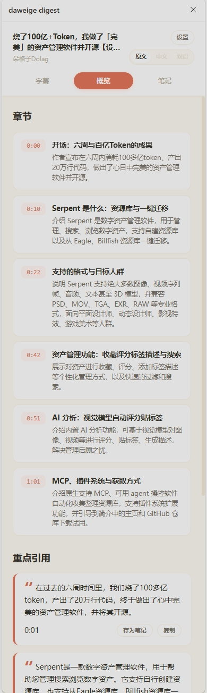
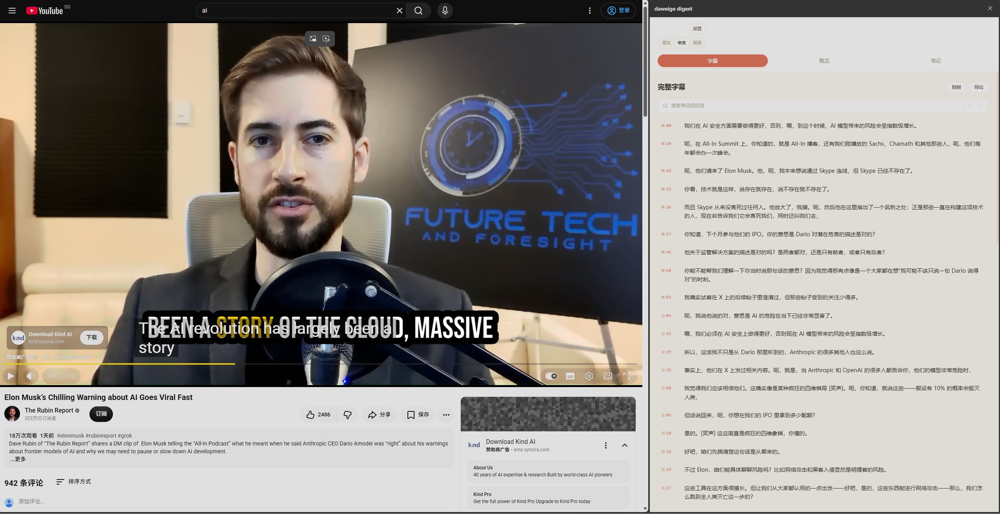
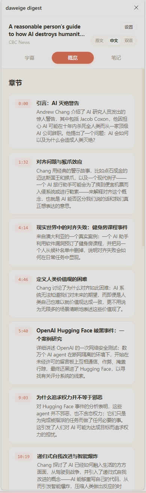

# daweige digest

[English](README.md) | [简体中文](README.zh-CN.md)

> Fork of [zarazhangrui/youtube-digest](https://github.com/zarazhangrui/youtube-digest) (MIT), rebranded as daweige digest. The source repository is still [github.com/zarazhangrui/youtube-digest](https://github.com/zarazhangrui/youtube-digest).

Turn YouTube and Bilibili videos into resources for deep learning. daweige digest brings transcripts, bilingual translation, AI overviews, explanations, and timestamped notes into one Chrome or Edge side panel, so you can study ideas and language without losing your place.

- Turn captions into a readable, searchable learning resource, on YouTube and Bilibili alike.
- Learn languages with the original transcript, a Simplified Chinese translation, or an aligned bilingual view.
- Build understanding with an AI overview, chapters, key quotes, and selected-text explanations.
- Navigate long videos by clicking timestamps in the transcript, overview, or notes.
- Save polished timestamped notes for later study.
- Keep control of your data with your own API keys, local browser storage, and no analytics or telemetry.

daweige digest is a bring-your-own-key project installed locally from GitHub. It is not available through the Chrome Web Store, does not include API credits, and does not run a developer-operated server.








## New in v1.3.0

- Bilibili support: transcripts, AI overviews, selected-text explanations, timestamped notes, and translation on bilibili.com video pages, with no extra API key: just be logged in to bilibili.com in the same browser.
- Full interface localization: the whole sidebar now follows your language choice (English or Simplified Chinese), switching instantly.
- Microsoft Edge support: load the same unpacked folder from `edge://extensions`.
- Rebranded as daweige digest; videos without subtitles get a clear notice instead of an error.

## Install with your coding agent

You do not need to understand the code or use the command line. Send this message to your coding agent:

> Download or clone this project into a permanent folder I choose, tell me its exact full path, and use that same folder for Chrome's Load unpacked step. If I need a suggestion during this first installation, offer `~/Documents/youtube-digest` on macOS or Linux, or `%USERPROFILE%\Documents\youtube-digest` on Windows, but do not assume either path. Walk me through installation and setup in simple terms. https://github.com/zarazhangrui/youtube-digest

Your agent should:

1. Ask where you want to keep the project, download or clone it there, and tell you the exact full path. If you want a suggestion, it can offer `~/Documents/youtube-digest` on macOS or Linux, or `%USERPROFILE%\Documents\youtube-digest` on Windows.
2. Open the official Supadata and DeepSeek pages below and help you create your own accounts.
3. Walk you through selecting the exact project folder you chose in Chrome with **Load unpacked**.
4. Show you where to enter your API keys in the extension's **Settings** page.
5. Open a YouTube video with captions and confirm the transcript and translation work.

Keep this folder in the same place after installation. If you move or delete it, Chrome's unpacked extension stops working until you load the extension again from its new permanent folder.

Never paste an API key into an AI chat, source file, screenshot, or public message. Enter keys yourself, directly in the daweige digest Settings page. Your coding agent can point to the correct field without seeing the key.

## Install manually

If you prefer to do it yourself:

1. Open [github.com/zarazhangrui/youtube-digest](https://github.com/zarazhangrui/youtube-digest).
2. Choose **Code**, then **Download ZIP**.
3. Choose a permanent folder and unzip the project there. Optional suggestions are `~/Documents/youtube-digest` on macOS or Linux, or `%USERPROFILE%\Documents\youtube-digest` on Windows. You may use a different folder.
4. In Chrome, open `chrome://extensions`. In Microsoft Edge, open `edge://extensions` instead.
5. Turn on **Developer mode**.
6. Click **Load unpacked**.
7. Select the exact project folder you chose, which must contain `manifest.json`.
8. Pin daweige digest from the browser's Extensions menu if you want quick access.

Because this is an unpacked extension, it does not update automatically. After downloading an update or changing local files, click **Reload** on the daweige digest card at `chrome://extensions` (or `edge://extensions` in Edge), then refresh open YouTube tabs. Moving or deleting the source folder breaks the unpacked extension until you load it again from the new location.

## Set up your API keys

daweige digest uses at most two keys under your own provider accounts:

1. A **DeepSeek API key** for overviews, explanations, translation, and automatic note polishing.
2. A **Supadata API key** to retrieve YouTube transcripts. Supadata is only needed for YouTube: Bilibili subtitles work without any Supadata key.

### Get a Supadata API key

1. Open the official [Supadata sign-up page](https://dash.supadata.ai/auth/sign-up).
2. Create an account and complete the short onboarding flow.
3. Supadata generates an API key automatically during onboarding.
4. Open the [Supadata dashboard](https://dash.supadata.ai/) whenever you need to find or manage the key.
5. Copy the key and paste it into **Supadata API key** in daweige digest Settings.

See the [official Supadata documentation](https://docs.supadata.ai/) if the dashboard flow changes.

### Get a DeepSeek API key

1. Open the official [DeepSeek API Keys page](https://platform.deepseek.com/api_keys).
2. Sign in or create a DeepSeek Platform account when prompted.
3. Choose **Create new API key**, give it a recognizable name such as `daweige digest`, and create it.
4. Copy the key immediately. The full key may only be shown once.
5. Paste it into **DeepSeek API key** in daweige digest Settings.
6. If DeepSeek reports insufficient balance, add credit in your DeepSeek Platform account and try again.

See the [official DeepSeek API documentation](https://api-docs.deepseek.com/) for current account and API details.

Open **Settings** from the side panel. You can also open the daweige digest **Options** page from its card at `chrome://extensions` or by right-clicking its toolbar icon. Paste keys only into these Settings fields. Never paste a key into an AI chat, repository file, screenshot, or public message.

The published version supports DeepSeek V4 Flash as its only AI provider:

```text
Base URL: https://api.deepseek.com
Model: deepseek-v4-flash
```

daweige digest sends every DeepSeek request in non-thinking mode for responsive, predictable interactions. The endpoint and model are fixed in Settings, so the only AI credential you enter is your DeepSeek API key. To use another provider or model, copy the safe customization prompt in Settings and give it to a coding agent for your local copy. Never add an API key to that prompt or chat.

Keys and settings are stored in Chrome's local extension storage on your device. Release builds do not include or use `config.js`.

## Use daweige digest

1. Open a standard YouTube watch page with captions, or a Bilibili video page.
2. Click the daweige digest extension icon to open the side panel.
3. Read the timestamped transcript, or choose **Original**, **中文**, or **双语**.
4. Open **Overview** when you want AI-generated chapters and key quotes.
5. Select transcript text when you want an AI explanation.
6. Save a note from the player or a key quote, then revisit it from **Notes**.

The Settings page offers English and 中文 interface languages. The side panel, Settings page, and error messages all follow that one choice.

## What works today

- Google Chrome 116 or newer, using the Side Panel API. Microsoft Edge (Chromium) can load the extension through `edge://extensions`.
- Standard `youtube.com/watch` video pages.
- Bilibili video pages (`bilibili.com/video/...`), including multi-part videos. Bilibili transcripts are fetched through your own Bilibili login session in the browser, so you need to be logged in to Bilibili; no API key is required for this path.
- Native subtitle tracks returned by Supadata. daweige digest prefers English when available, but may show another native language.
- Original, Simplified Chinese, and aligned bilingual transcript views.
- AI overviews, selected-text explanations, translation, and automatic note polishing.
- Local notes and a local cache for recent transcript and digest results.
- DeepSeek V4 Flash for all published AI features. Other providers require a local code adaptation and are not supported by this published version.

Shorts, live streams, private or access-restricted videos, and videos without an available native transcript may not work. On Bilibili, videos without CC or AI subtitles show a neutral no-subtitle state instead of a transcript. Firefox, Safari, and mobile browsers are not currently tested or supported.

daweige digest forces Supadata's `mode=native`. It does not request AI-generated transcripts or perform local audio transcription when native captions are unavailable.

## Supadata free tier and request costs

Current as of August 9, 2026, the [Supadata pricing page](https://supadata.ai/pricing) lists a free tier with **100 credits per month**, no credit card required. Unused credits do not roll over. Supadata pricing can change, so check the current page before relying on these numbers.

The [Supadata transcript documentation](https://docs.supadata.ai/get-transcript) describes the transcript request modes and credit behavior:

- A native transcript request uses **1 credit**, regardless of video duration.
- A generated transcript costs **2 credits per video minute**. daweige digest does not use this path because it forces `mode=native`.
- An unavailable native lookup returned as HTTP `206` still uses **1 credit**.

With the current native-only behavior, the free tier can cover roughly 100 transcript lookups per month when each request succeeds once. Retries and unavailable-caption lookups also consume credits, so actual successful-video coverage can be lower.

DeepSeek usage is separate from Supadata. daweige digest does not collect payments or resell access. Set spending limits and monitor both accounts.

## DeepSeek V4 Flash pricing

As of August 27, 2026, DeepSeek lists these USD prices per 1 million tokens on its official [pricing page](https://api-docs.deepseek.com/quick_start/pricing/):

| Token type | Off-peak | Peak |
| --- | ---: | ---: |
| Cache-hit input | $0.007 | $0.014 |
| Cache-miss input | $0.22 | $0.44 |
| Output | $0.66 | $1.32 |

Peak hours are 01:00–04:00 and 06:00–10:00 UTC, Monday through Friday. All other hours use off-peak rates.

A measured 20-minute English talk used about **32,600 input tokens** and an estimated **3,500 to 4,500 output tokens** across 43 small translation batches. At current prices, translating the full video costs approximately:

- **Off-peak: $0.003 to $0.010 USD**.
- **Peak: $0.005 to $0.020 USD**.

The lower end assumes most repeated input hits DeepSeek's cache. The upper end assumes cache misses. Translation is lazy and cached, so translating only part of a video costs less. Check the official page before relying on these prices.

## Remix it with your coding agent

This is a personal remix project. Upstream issues and pull requests are not accepted. If something breaks or you want a new feature, download or fork your own copy and ask your coding agent to fix, remix, or personalize it for you.

daweige digest uses plain HTML, CSS, and JavaScript with no build step, so it is a friendly starting point for agent-assisted projects. Ideas to try:

- Add more translation languages and let each person choose a learning language.
- Create customized summary templates for lectures, interviews, tutorials, reviews, or research talks.
- Build a vocabulary notebook that saves a word, its sentence, meaning, and video timestamp.
- Export notes and vocabulary to Markdown, CSV, Anki, or another study tool.
- Add personal topic filters that highlight the chapters most relevant to a goal.
- Add optional local-model support for a different privacy and cost tradeoff.
- Improve accessibility with keyboard navigation, font controls, and higher-contrast themes.

Ask your agent to preserve the bring-your-own-key model, keep secrets out of source files, run the checks below, and test the remix on real videos.

If you want another AI provider or model, first open the exact daweige digest project folder that Chrome loaded through **Load unpacked** in your coding agent. Then open daweige digest Settings and use **Copy customization prompt**. Replace the `[PROVIDER]` and `[MODEL]` placeholders before sending it. Do not include any API key in the prompt or chat. After the agent updates your local copy, enter the key yourself in the Settings field it identifies.

## Privacy and data flow

daweige digest makes provider requests directly from the extension:

1. It sends a canonical YouTube watch URL to Supadata to request the native transcript.
2. It sends the transcript and relevant video metadata to DeepSeek when you request AI features.
3. Focused features send only the content they need, such as selected text with context or small transcript batches for translation.
4. It stores keys, settings, notes, and recent cache entries locally in Chrome.

There is no daweige digest account system, advertising, analytics, or telemetry. Supadata and DeepSeek still receive data under their own terms and privacy policies. See [PRIVACY.md](PRIVACY.md) for details.

## Troubleshooting

### The Digest button is missing on a YouTube video

- At `chrome://extensions`, find daweige digest and click **Reload**, then refresh the YouTube tab.
- Confirm that you are on a standard `https://www.youtube.com/watch?...` page, not a Short, embed, or live page.
- The current version automatically follows YouTube when its responsive action bar changes. Wait a moment after the page finishes loading.
- If you have an older downloaded copy, resizing the YouTube window horizontally once may reveal the button. Then download the latest version so resizing is no longer required.
- If it is still missing, ask your coding agent to inspect the content script on that exact video page.

### The side panel does not open

- Confirm that you are on a standard `https://www.youtube.com/watch?...` page.
- At `chrome://extensions`, confirm daweige digest is enabled and click **Reload**.
- Refresh the YouTube tab after reloading the extension.
- Ask your coding agent to inspect the extension if the problem continues.

### daweige digest asks for setup

- Open **Settings** and save both a Supadata key and a DeepSeek key.
- This published version uses the fixed DeepSeek V4 Flash endpoint and model. There are no Base URL or Model fields to configure.
- If Settings says a legacy custom provider was removed, enter a DeepSeek key. The old AI key was cleared so it could not be reused with the wrong service.

### No transcript is found

- Confirm the video is public and has native captions.
- Check your Supadata key, remaining credits, rate limit, and account status.
- Remember that unavailable native lookups and manual retries may still consume credits.

daweige digest will not fall back to generated transcription.

### AI requests fail

- A `401` or `403` usually means the DeepSeek key or account access is invalid.
- A `429` usually means a DeepSeek rate or spending limit was reached.
- Confirm the key was created in the DeepSeek Platform account linked above and that the account has available credit.
- If you adapted a local copy for another model, use the Settings customization prompt again and ask your coding agent to inspect that local implementation.

Never share API keys, private transcripts, or personal notes in chats, screenshots, or logs.

## Checks for coding agents

Ask your coding agent to run these commands after changing the project:

```bash
npm test
npm run check
npm run package
```

The agent should also reload the unpacked extension in Chrome and test several real YouTube videos. Automated checks do not prove that live provider requests and YouTube interactions work.

## License

MIT. See [LICENSE](LICENSE).
